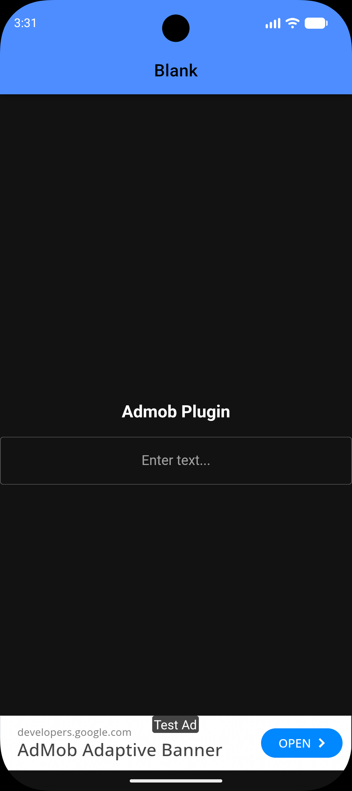
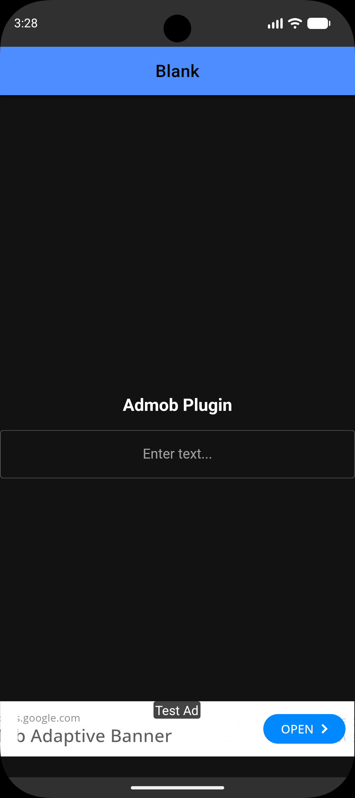

# Minimal reproduction

This repository contains a minimal reproduction for the Comment https://github.com/ionic-team/capacitor/pull/8424#issuecomment-4307798967.

### Environment used for testing
- macOS (development)
- Ionic / Capacitor (this project)
- Android Emulator 16 (API 36) With Play Store in Android Studio
- Android WebView version latest (146) and below (tested on 136) installed on the emulator

### Steps to reproduce
1. Install project dependencies (this repo uses pnpm because a patch with the PR changes is applied):

```bash
pnpm install
```

2. Run the app on the emulator:

```bash
pnpm start
```

3. Open the app on the emulator

### Screenshots

Below are screenshots that illustrate the issue described above.

| Android 16 WebView 146 | Android 16 WebView 136 |
|---|---|
|  |  |

